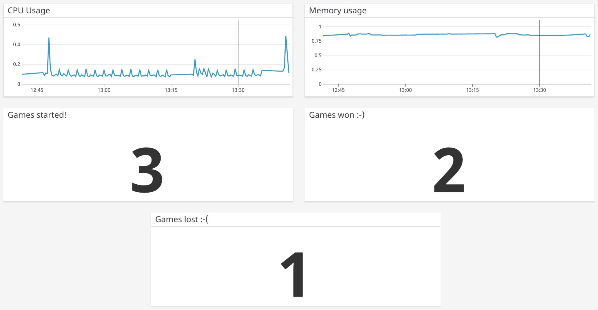

# Week 3 - Assignment :cherry_blossom:

## 1. About project

This project was created for the class **Hagnýt Gæðastjórnun og prófanir** (SC-T-542-HGOP).

## 2. How to run project:

### 2.1 Game API is running on

- IP address: **http://IP:3000/status**. See the IP address in the output in the project DeploymentAWS on Jenkins. The Game API is running on that IP address on port 3000. You should see: **The API is running!**
- To play game: **http://IP:4000**. Use the same IP address that you receive from Jenkins.

### 2.2 Jenkins URL

- **URL:** http://ec2-52-90-206-44.compute-1.amazonaws.com:8080/

### 2.3 Jenkins user:

- **username:** hgop
- **password:** abc123

### 2.4. DataDog :dog:

- We invited Hrafn Orri to our team in DataDog.

#### 2.4.1 Screenshot of our DataDog Dashboard

## 4. Authors :dancers:

Eva Sif Einarsdóttir and Ísabella Ýr Finnsdóttir

## 5. Teachers

Guðlaugur Stefán Egilsson and Hannes Pétursson

**Teaching assistants**:
Hrafn Orri Hrafnkelsson and Kristinn Þorri Þrastarson
